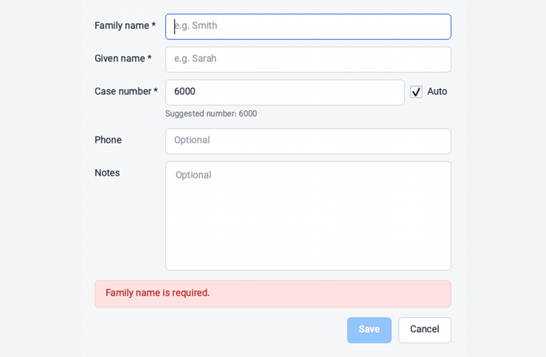
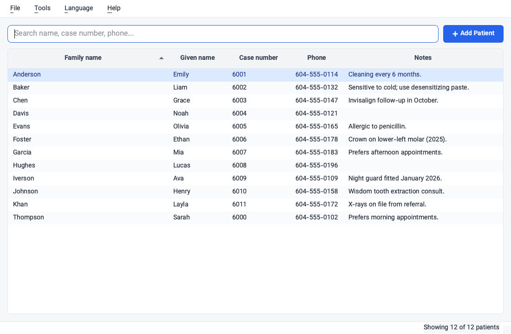
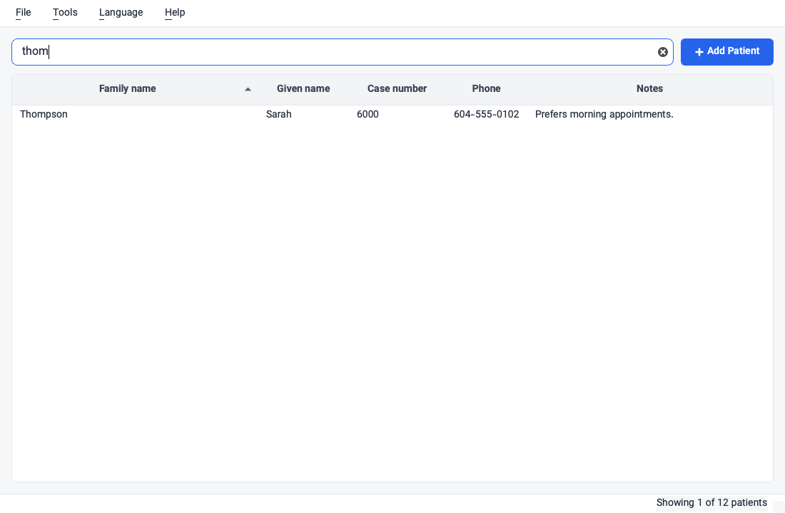
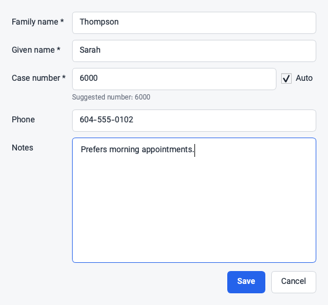
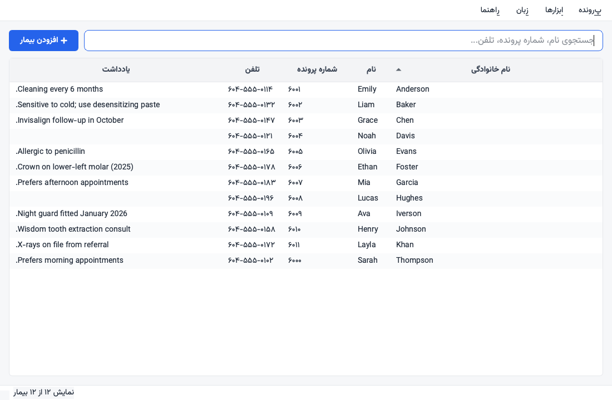

# Dental Patients

An offline-first desktop application for managing dental patient records — built
for a real clinic front desk running on modest hardware.



- **Stack**: C++20 + Qt 6 Widgets + SQLite (FTS5)
- **Target**: Windows 10 / 11, x86-64 (the codebase is portable Qt and also
  builds on macOS/Linux for development)
- **Designed for**: low-end hardware — works comfortably on 2 GB RAM
- **Storage**: fully offline, a single SQLite file in `%APPDATA%\DentalPatients\`
- **Languages**: English by default, with a complete Persian (RTL) localization
  available from the **Language** menu
- **Distribution**: single Inno Setup `.exe` installer

## Screenshots

| Patient list | Instant search |
| --- | --- |
|  |  |

| Add / edit patient | Localized UI |
| --- | --- |
|  |  |

All names shown are fictional demo data.

## Features

- **Instant search** across name, case number, and phone with a 120 ms debounce —
  snappy even on the slowest clinic machine. Search normalizes Arabic-script
  variants, digits, and joiners so visually identical names always match.
- **Auto case numbers**: the add dialog can pick the first free case number,
  with duplicates allowed only as an explicit user decision.
- **Backups first**: a `.dpbackup` snapshot is written automatically on the
  first launch of each day (last 30 kept), plus manual backup/restore from the
  **Tools** menu. Double-clicking a `.dpbackup` file opens the restore flow.
- **Corruption recovery**: `PRAGMA integrity_check` runs on every startup; if
  the database is damaged the app offers one-click restore from the most
  recent backup.
- **Recycle bin**: deletes are soft — patients move to a trash table and can be
  restored from **Tools → Recycle bin**.
- **CSV export** for Excel or manual inspection.
- **Single instance**: launching the app twice focuses the running window
  instead of opening a second copy.

## End-user usage

1. Double-click `DentalPatients-Setup-<version>.exe`.
2. Click "Install".
3. Launch from the Start menu or desktop shortcut.

On first launch the app shows a setup view: load the clinic's `.dpbackup` file
to populate the patient database, or start with an empty one. After setup, all
active data lives in `%APPDATA%\DentalPatients\patients.db`.

### Updates

Hand the user a newer `DentalPatients-Setup-<new_version>.exe`. Double-click,
"Install". The installer detects the existing version via the stable `AppId`,
upgrades the binaries in place, and **leaves all patient data untouched**.

### Switching the language

**Language → English / فارسی**, then restart when prompted. The setting is
per-machine and persists across updates. The Persian mode is a complete
localization: right-to-left layout, translated UI, and Persian digit rendering.

## Developer setup

### Windows (release builds + installer)

Requires admin PowerShell on Windows 10/11.

```powershell
# One-time install of MSVC build tools, CMake, Ninja, Python, Inno Setup, Qt 6.
scripts\setup-windows.ps1

# Build + tests
scripts\run-tests.ps1

# Build release + installer
scripts\build-release.ps1
```

After `build-release.ps1` the installer is at:

```text
installer\Output\DentalPatients-Setup-<version>.exe
```

### macOS / Linux (development)

```bash
cmake -S . -B build -G Ninja -DCMAKE_BUILD_TYPE=Release \
      -DCMAKE_PREFIX_PATH=<path-to-Qt6>
cmake --build build
ctest --test-dir build
./build/DentalPatients
```

### Bumping the version

1. Edit `project(DentalPatients VERSION X.Y.Z ...)` in `CMakeLists.txt`.
2. Re-run `scripts\build-release.ps1`. The installer filename, the .exe's
   resource version, and the in-app About dialog all read from the same
   single source of truth.

## Layout

```text
.
|-- CMakeLists.txt                 # build entrypoint
|-- src/
|   |-- main.cpp
|   |-- core/AppLanguage.*         # language setting + built-in translation
|   |-- core/PersianText.*         # text normalisation for search/storage
|   |-- db/                        # SQLite schema, repository, backups
|   `-- ui/                        # MainWindow + dialogs + table model
|-- tests/                         # Qt Test units
|-- assets/
|   |-- fonts/Vazirmatn-*.ttf      # bundled UI font (SIL OFL)
|   |-- icons/app.rc               # Windows .exe metadata
|   `-- styles/app.qss             # light theme
|-- docs/media/                    # README screenshots (fictional demo data)
|-- installer/DentalPatients.iss   # Inno Setup script
`-- scripts/
    |-- setup-windows.ps1          # one-shot dev environment install
    |-- run-tests.ps1              # build + ctest
    `-- build-release.ps1          # build + windeployqt + Inno Setup
```

## Robustness guarantees

- **WAL journal mode** + `PRAGMA synchronous = NORMAL` - durable across app
  crashes; only an OS-level crash can lose the most recent unflushed write.
- All multi-step writes wrapped in transactions.
- `PRAGMA integrity_check` on every startup; auto-restore prompt if it fails.
- `.dpbackup` is the canonical data transfer and restore format.
- Daily backup with rotation (last 30 kept).
- Restore validates the selected backup and stages it before replacing the
  current database.
- Soft delete: removed records are moved to `patients_trash`, restorable from
  the UI.
- Patient names are stored as separate family/given-name fields. Sorting is
  limited to family name (with given-name tie-break) and file number.
- Patient data lives in `%APPDATA%`, never inside the install dir, so an
  uninstall **cannot** remove patient records.

## License

The application source is the customer's. The bundled Vazirmatn font is
licensed under the SIL Open Font License 1.1 (see `assets/fonts/OFL.txt`).
